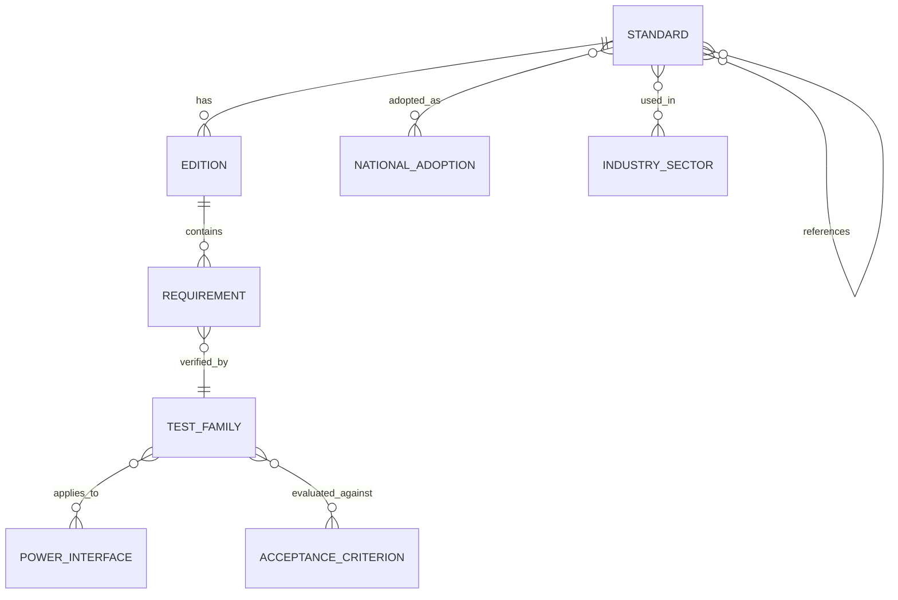

# Global Power-Supply Testing Standards — Cross-Industry Research

**Research date:** 2026-09-21  
**Repository:** `ami3go/Powe-supply-tests`  
**Purpose:** Build a traceable cross-industry inventory of standards that explicitly test a power source, power input/output, standby source, battery, or power port, or that impose qualification testing on powered equipment.

> [!IMPORTANT]
> This is a standards-engineering research index, not a substitute for the licensed normative documents. Numerical severity levels, waveforms, durations, impedances, sample counts and acceptance criteria must be taken from the exact applicable edition and contract/regulatory basis.

> [!NOTE]
> This research uses public standards catalogues, issuing-body metadata and publicly released government/military material. It does **not** use or reproduce classified, export-controlled, secret, NDA-protected, leaked or unlawfully obtained documents. Commercial/paywalled standards are identified from public metadata and their publicly verifiable scope is summarized.

## Executive summary

The research identified and normalized **38 verified standards, national adoptions, regulatory guides and historically important revisions** covering general power electronics, UPS, medical and life-support equipment, railway, maritime, civil aviation, military ground vehicles, spacecraft/satellites and nuclear power.

The most important conclusion is that there is no single universal “power-supply test standard”. Qualification is normally a stack:

```text
source performance
  -> electrical safety
  -> power-port EMC/transients
  -> sector environmental qualification
  -> reliability/failover/endurance
  -> national/regulatory adoption
```

The meaning of “power-supply testing” changes by industry:

- **Medical/life-support:** electric shock, leakage, dielectric safety, single-fault behavior and essential performance during disturbances.
- **Railway / military vehicle:** unstable DC buses, interruptions, transients and environmental robustness.
- **Civil aviation:** power-input variation, voltage spikes, conducted susceptibility, lightning-related transients and environment.
- **Space/satellite:** power-line EMC plus thermal-vacuum, vibration, shock and mission qualification.
- **Nuclear:** emergency-source start reliability, load acceptance, voltage/frequency performance, endurance and periodic surveillance.

Revision control is critical. Examples verified during this research include **EN 50155:2026** replacing the 2021 railway edition in at least some national catalogues, **IEEE/IEC 63332-387-2024** superseding IEEE 387-2017, and **ISO 80601-2-12:2023** replacing the 2020 ventilator edition.

---

## Research method

| Phase | Search activity | Acceptance rule |
|---|---|---|
| Scope decomposition | Split “power-supply testing” into source performance, input immunity, output performance, safety, EMC, battery, environmental qualification, endurance/reliability and redundancy/failover. | Do not exclude a standard merely because its title lacks the words “power supply”. |
| International core | IEC, ISO, IEEE/IEC and IECEE catalogues. | Prefer issuing-body records and current editions. |
| Industry verticals | Medical/life support, railway, marine, aviation, military, space/satellite and nuclear. | Search both product/platform standards and generic standards they invoke. |
| National adoption pass | BSI, EVS, SIS, CSA, DIN/DIN Media, Standards Australia, JISC and other national catalogues. | Distinguish true national adoption from a national shop reselling an IEC/ISO document. |
| Multilingual pass | English plus German, French, Swedish, Chinese, Japanese, Russian, Portuguese and Spanish terminology. | Prefer authoritative native-language catalogue evidence. |
| Revision/history pass | Amendments, corrigenda, replacements and withdrawal records. | Keep older editions only where historically useful; mark status explicitly. |
| Test extraction | Extract and normalize power-related test families. | Do not invent unpublished numerical severity levels. |
| Cross-reference pass | Map product/platform standards to generic EMC, safety and environmental methods. | Separate direct requirements from inherited/supporting tests. |

### Relevance classification

- **Direct** — the standard itself contains requirements/tests for the power source, input or output.
- **Power-port** — principal relevance is immunity/emission testing at AC/DC power connections.
- **Inherited** — a product standard applies electrical/EMC tests through a parent/collateral standard.
- **Supporting** — qualifies powered equipment through environmental/reliability testing rather than characterizing the PSU alone.

### Confidence classification

- **High** — issuing-body public record explicitly states the relevant scope/test purpose.
- **Medium** — official catalogue verifies edition/scope, but detailed clauses are paywalled; only test families are reported.

---

## Master standards inventory

| Standard | Issuer | Country / region | Year / status | Industry | Relevance | Power-related tests / test families | Useful categories | Access / applicability | Official source | Confidence |
|---|---|---|---|---|---|---|---|---|---|---|
| **IEC 62040-3 — Uninterruptible power systems, Part 3: method of specifying performance and test requirements** | IEC | International | **2021**, current edition found | UPS, data centre, industrial power | Direct | • Input operating characteristics<br>• Output steady-state performance<br>• Dynamic/transient output behaviour<br>• Stored-energy operation<br>• Transfer/bypass behaviour<br>• Overload/short-circuit performance<br>• Efficiency/performance classification | Electrical; performance; transient; battery; overload | Commercial normative standard | https://www.iecee.org/certification/iec-standards/iec-62040-32021 | High |
| **IEC 61204-3 — Low-voltage switch-mode power supplies, Part 3: EMC** | IEC | International | **2016**, current edition found | SMPS, industrial, ICT | Direct / power-port | • Conducted emissions<br>• Radiated emissions<br>• ESD immunity<br>• RF immunity<br>• Fast-transient/burst immunity<br>• Surge immunity<br>• Supply dips/interruptions where applicable | EMC; EMI; surge; transient; ESD; power quality | Commercial normative standard | https://webstore.iec.ch/en/publication/26124 | High/Medium |
| **IEC 61204-7 — Low-voltage switch-mode power supplies, Part 7: safety requirements** | IEC | International | **2016**, current edition found | SMPS, embedded power | Direct | • Electric-shock protection<br>• Insulation/dielectric verification<br>• Protective earthing<br>• Heating/temperature behaviour<br>• Abnormal/overload conditions<br>• Output-energy/short-circuit protection | Safety; isolation; insulation; thermal; overload; short circuit | Commercial normative standard | https://webstore.iec.ch/en/publication/26155 | High/Medium |
| **IEC 61558-1 — Safety of transformers, reactors, power-supply units and combinations, general requirements and tests** | IEC | International | **2017; COR1:2025** | Transformers, PSUs, industrial/consumer | Direct | • Temperature rise/heating<br>• Short-circuit and overload behaviour<br>• Dielectric strength/insulation<br>• Protective measures<br>• Mechanical safety<br>• Output/operating-condition checks | Safety; thermal; isolation; insulation; overload; mechanical | Commercial normative standard | https://webstore.iec.ch/en/publication/26261 | High |
| **IEC 61000-4-11 — Voltage dips, short interruptions and voltage variations immunity tests** | IEC | International | **2020; COR2:2022** | Horizontal EMC; AC equipment | Power-port | • Voltage dips<br>• Short interruptions<br>• Supply-voltage variations | Power quality; interruption; EMC immunity | Generic method; product standard selects severities and criteria | https://webstore.iec.ch/en/publication/63503 | High |
| **IEC 61000-4-11:2004+A1:2017** | IEC | International | Historical; replaced by 2020 edition | Horizontal EMC | Power-port | • Voltage dips<br>• Short interruptions<br>• Voltage variations | Power quality; EMC | Legacy qualifications may still cite it | https://webstore.iec.ch/en/publication/60729 | High |
| **IEC 60335-1 — Household and similar electrical appliances, general safety** | IEC | International | **2020+A1:2025** | Appliances; battery/DC products | Direct / inherited | • Input/current and heating checks<br>• Leakage/dielectric safety<br>• Abnormal operation<br>• Overload/protective behaviour<br>• Transient/insulation-related safety<br>• Mechanical safety | Safety; insulation; thermal; abnormal operation | Use with applicable IEC 60335-2-x particular standard | https://webstore.iec.ch/en/publication/85018 | High/Medium |
| **IEC 61010-1 — Safety requirements for electrical measuring, control and laboratory equipment** | IEC | International | **2010+A1:2016** | Laboratory/test/control equipment | Direct / inherited | • Mains/input safety<br>• Leakage/touch current<br>• Dielectric/insulation<br>• Protective earth<br>• Temperature<br>• Single-fault/abnormal operation | Safety; isolation; insulation; thermal; fault | Commercial normative standard | https://www.boutique.afnor.org/fr-fr/norme/iec-6101012010-amd12016/amendement-1-regles-de-securite-pour-appareils-electriques-de-mesurage-de-r/xs129178/250006 | Medium |
| **IEC 62133-2 — Safety requirements for portable sealed secondary lithium cells/batteries** | IEC | International | **2017+A1:2021** | Portable equipment, battery power | Direct battery source | • External short circuit<br>• Thermal-abuse testing<br>• Mechanical abuse/drop-type testing<br>• Overcharge protection<br>• Forced-discharge-type abuse tests | Battery; charging/discharging; short circuit; thermal; mechanical; safety | Commercial normative standard | https://www.boutique.afnor.org/fr-fr/norme/iec-6213322017-amd12021/amendement-1-accumulateurs-alcalins-et-autres-accumulateurs-a-electrolyte-n/xs139703/264038 | Medium |
| **IEC 61204-3:2000** | IEC | International | Historical; **superseded** | SMPS | Direct / power-port | • SMPS emissions<br>• Immunity/power-port disturbance testing | EMC; transient | Legacy only | https://webstore.iec.ch/en/publication/19337 | High |
| **IEC 61204-7:2006** | IEC | International | Historical; **replaced by 2016** | SMPS | Direct | • Electric-shock/insulation safety<br>• Abnormal/thermal conditions | Safety; isolation; thermal | Legacy only | https://webstore.iec.ch/en/publication/4904 | High |
| **IEC 60601-1 — Medical electrical equipment, general requirements for basic safety and essential performance** | IEC | International | **2005+A1:2012+A2:2020**, later corrigenda | Medical; life support | Direct / inherited | • Power-input verification<br>• Protective earth<br>• Leakage/touch/patient-current safety<br>• Dielectric strength/insulation<br>• Heating/temperature<br>• Abnormal operation and single-fault conditions | Electrical safety; leakage; isolation; thermal; fault | Use with collateral and applicable particular standards | https://webstore.iec.ch/en/publication/67497 | High/Medium |
| **IEC 60601-1-2 — Medical electrical equipment, electromagnetic disturbances** | IEC | International | **2014+A1:2020** | Medical; life support | Power-port / EMC | • ESD<br>• Radiated RF<br>• Conducted RF<br>• EFT/burst at applicable ports<br>• Surge at applicable power ports<br>• Power-frequency magnetic field<br>• Voltage dips and interruptions | EMC; surge; transient; power quality; ESD; essential performance | Commercial normative standard | https://webstore.iec.ch/en/publication/2590 | High |
| **EVS-EN 60601-1-2:2015+A1:2021** | EVS / CENELEC | Estonia / Europe | **2021** | Medical | National adoption / power-port | • Same principal IEC 60601-1-2 EMC/power-port immunity families<br>• Voltage dips/interruptions<br>• Surge/EFT<br>• Conducted/radiated immunity | EMC; power quality; surge; transient | Estonian national implementation | https://www.evs.ee/en/evs-en-60601-1-2-2015-a1-2021-consolidated | High |
| **ISO 80601-2-12 — Critical-care ventilators** | ISO/IEC | International | **2023**, current; 2020 withdrawn | Medical; life support | Inherited / direct | • Internal/external electrical-source requirements<br>• Behaviour on loss/change of power as applicable<br>• Essential-performance verification during disturbances<br>• IEC 60601-1 electrical safety<br>• IEC 60601-1-2 EMC | Life support; battery; redundancy; power loss; EMC | Particular standard for critical-care ventilators | https://www.iso.org/standard/82707.html | High/Medium |
| **CSA C22.2 No. 80601-2-12:21** | CSA Group | Canada | **2021** | Medical; ventilators | National adoption | • Medical electrical safety<br>• Power-source/essential-performance requirements inherited from 80601/60601 framework<br>• EMC through collateral standard | Safety; life support; EMC; battery/power source | Canadian national standard | https://www.csagroup.org/store/product/2429555/ | Medium |
| **EN 50155 — Railway applications, rolling stock, electronic equipment** | CENELEC | Europe | **2026**, current European edition identified | Railway | Direct | • Supply-voltage operating range/variation<br>• Interruptions<br>• Supply changeover<br>• Overvoltage/transient behaviour<br>• EMC immunity<br>• Temperature<br>• Vibration/shock via associated standards | Power quality; interruption; transient; EMC; thermal; vibration; shock | European normative standard | https://www.evs.ee/en/evs-en-50155-2026 | High |
| **EVS-EN 50155:2026** | EVS / CENELEC | Estonia | **2026**, valid from 18 May 2026 | Railway | National adoption | • Railway supply variations/interruption<br>• Electrical operating-condition tests<br>• Environmental qualification<br>• EMC-related tests | Power quality; electrical; environmental; EMC | Estonian national adoption | https://www.evs.ee/en/evs-en-50155-2026 | High |
| **BS EN 50155:2026** | BSI / CENELEC | United Kingdom | **2026** | Railway | National adoption | • Supply operating conditions<br>• Interruptions/changeover<br>• Electrical disturbances<br>• Environmental tests | Power quality; transient; environmental; EMC | UK implementation | https://www.dinmedia.de/de/norm/bs-en-50155/403609011 | High for status |
| **SS-EN 50155:2021** | SIS / CENELEC | Sweden | **2021**, transition/legacy relative to EN 50155:2026 | Railway | National adoption | • Supply-voltage variation<br>• Interruptions/changeover<br>• Environmental/EMC qualification | Electrical; EMC; environment | Swedish implementation; verify current transition for new projects | https://www.sis.se/produkter/jarnvagsteknik-6ecab143/rullande-material/dragfordon/ss-en-50155-utg-52021/ | High for edition |
| **IEC 60571 — Electronic equipment used on rolling stock** | IEC | International | **2012**, current record retrieved | Railway | Direct | • Supply-voltage variation/interruption families<br>• Electrical operating-condition tests<br>• Temperature/humidity<br>• Shock/vibration and functional verification<br>• EMC through related standards | Power quality; environmental; vibration; shock; EMC | Commercial normative standard | https://webstore.iec.ch/en/publication/2514 | High/Medium |
| **IEC 62236-3-2 — Railway EMC, rolling stock apparatus** | IEC | International | **2018** | Railway | Power-port / EMC | • Conducted emissions<br>• Radiated emissions<br>• Conducted RF immunity<br>• Radiated RF immunity<br>• ESD<br>• Transient/burst and surge at applicable ports | EMC; EMI; transient; surge; ESD | Apparatus-level railway EMC | https://www.iecee.org/certification/iec-standards/iec-62236-3-22018 | High/Medium |
| **IEC 62236-3-1 — Railway EMC, train and complete vehicle** | IEC | International | **2018** | Railway | Supporting vehicle-level EMC | • Whole-vehicle emission tests<br>• Immunity requirements<br>• Interaction of powered equipment with railway EM environment | EMC; system-level | Companion to apparatus-level requirements | https://webstore.iec.ch/en/publication/33621 | High |
| **IEC 60945 — Maritime navigation and radiocommunication equipment, general requirements and methods of testing** | IEC | International | **2002; corrigendum 2008**, maintained record found | Marine / shipboard electronics | Direct / supporting | • Supply-voltage/frequency variation as applicable<br>• Supply interruption/failure behaviour<br>• Power-supply disturbance immunity<br>• Conducted/radiated EMC<br>• ESD<br>• Environmental/temperature/vibration tests | Power quality; EMC; transient; environmental; vibration; safety | Marine equipment normative standard | https://webstore.iec.ch/en/publication/3959 | High/Medium |
| **BS EN 60945** | BSI / CENELEC | United Kingdom | EN 60945:2002; UK publication **2003** | Marine | National adoption | • Power-system disturbance tests<br>• Electrical safety<br>• EMC<br>• Environmental/type tests | Power quality; EMC; safety; environment | UK implementation | https://knowledge.bsigroup.com/products/maritime-navigation-and-radiocommunication-equipment-and-systems-general-requirements-methods-of-testing-and-required-test-results | High |
| **RTCA DO-160G — Environmental Conditions and Test Procedures for Airborne Equipment** | RTCA | United States / internationally used | Revision **G** | Civil aerospace | Direct / supporting | • Section 16: Power Input<br>• Section 17: Voltage Spike<br>• Section 18: Audio-frequency conducted susceptibility — power inputs<br>• Induced-signal susceptibility<br>• RF susceptibility<br>• Lightning-induced transient susceptibility<br>• ESD and environmental tests | Power quality; transient; EMC; lightning; vibration; thermal | Proprietary/commercial; not classified | https://my.rtca.org/NC__Product?id=a1B36000001IcnSEAS | High |
| **EUROCAE ED-14G** | EUROCAE | Europe / international aviation | Revision **G** | Civil aerospace | Direct / supporting | • Power-input testing<br>• Voltage spike<br>• Conducted susceptibility on power inputs<br>• Lightning/EMC/environmental qualification | Power quality; transient; EMC; lightning; environment | European counterpart coordinated with DO-160G | https://my.rtca.org/NC__Product?id=a1B36000001IcnSEAS | High for equivalence |
| **RTCA DO-311A — Minimum Operational Performance Standards for Rechargeable Lithium Batteries and Battery Systems** | RTCA | United States / aviation | **2017** | Aviation batteries | Direct battery source | • Charge/discharge performance<br>• Electrical-abuse protection<br>• Short-circuit behaviour<br>• Thermal/environmental qualification<br>• Mechanical/vibration/shock qualification<br>• Hazard containment/battery-system safety | Battery; charge/discharge; thermal; short circuit; vibration; safety | Proprietary/commercial | https://my.rtca.org/NC__Product?id=a1B36000004iHaKEAU | High/Medium |
| **MIL-STD-1275E — Characteristics of 28 Volt DC Input Power to Utilization Equipment in Military Vehicles** | US DoD / DLA | United States | **2013, Revision E copy verified** | Military ground vehicles | Direct | • Normal DC input range<br>• Ripple/noise environment<br>• Vehicle-start disturbances<br>• Surge/transient events<br>• Spike events<br>• Reverse/abnormal polarity conditions as applicable | Power quality; surge; spike; transient; DC; military | Public DoD copy verified; check current contract revision | https://quicksearch.dla.mil/WMX/Default.aspx?token=5721471 | High/Medium |
| **ECSS-E-ST-20-07C Rev.2 — Electromagnetic Compatibility** | ECSS | Europe / space | **2022-01-03** | Spacecraft, satellites, launch/space equipment | Power-port / supporting | • Conducted emission on power/signal lines<br>• Conducted susceptibility<br>• Radiated emission<br>• Radiated susceptibility<br>• EMC verification at subsystem/system level | EMC; EMI; conducted; radiated; power-line susceptibility | Space engineering normative standard | https://ecss.nl/standard/ecss-e-st-20-07c-rev-2-electromagnetic-compatibility-3-january-2022/ | High |
| **ECSS-E-ST-10-03C Rev.1 — Testing** | ECSS | Europe / space | **2022-05-31** | Spacecraft, satellites | Supporting | • Functional/performance testing<br>• Qualification/acceptance testing<br>• Thermal-vacuum exposure with functional checks<br>• Vibration<br>• Mechanical shock<br>• Pre/post-environment electrical functional verification | Environmental; thermal-vacuum; vibration; shock; performance | General space-system verification/testing framework | https://ecss.nl/standard/ecss-e-st-10-03c-rev-1-testing-31-may-2022/ | High/Medium |
| **GSFC-STD-7000B — General Environmental Verification Standard for GSFC Flight Programs and Projects** | NASA Goddard | United States | **2021** | Spacecraft, payloads, satellites | Supporting | • Functional verification around environments<br>• Thermal-vacuum<br>• Random/sine vibration as applicable<br>• Mechanical shock<br>• Acoustic/environmental qualification<br>• Qualification/acceptance regimes | Thermal; vibration; shock; reliability; environment | Public NASA standard | https://standards.nasa.gov/center-specific-standards?field_nasa_organization_value=GSFC&order=field_std_document_version&sort=asc | High/Medium |
| **IEEE/IEC 63332-387-2024 — Nuclear facilities, electrical power systems, diesel generator units applied as standby power sources** | IEEE / IEC | International | **2024**, current successor to IEEE 387-2017 | Nuclear | Direct | • Starting and acceleration<br>• Voltage/frequency performance<br>• Sequential/load acceptance<br>• Load rejection<br>• Capacity/load testing<br>• Endurance/operability<br>• Qualification and periodic/reliability-related tests | Standby power; reliability; endurance; failover; voltage/frequency | Commercial normative standard | https://standards.ieee.org/ieee/387/5630/ | High |
| **IEEE 387-2017 — Diesel generator units as standby power supplies for nuclear generating stations** | IEEE | United States | **2017; superseded** | Nuclear | Direct / historical | • Diesel-generator start<br>• Load acceptance<br>• Voltage/frequency<br>• Capacity/endurance<br>• Reliability/periodic testing | Standby power; reliability; endurance | Historical; may remain part of existing plant licensing bases | https://standards.ieee.org/ieee/387/5630/ | High |
| **IEEE 2420-2019 — Combustion turbine-generator units applied as standby power supplies for nuclear power generating stations** | IEEE | United States | **2019** | Nuclear | Direct | • Starting capability<br>• Load acceptance<br>• Voltage/frequency performance<br>• Capacity/endurance<br>• Reliability/availability verification | Standby power; failover; performance; reliability | Commercial normative standard | https://standards.ieee.org/ieee/387/594/ | High |
| **IEEE/IEC 60780-323-2016 — Nuclear facilities, electrical equipment important to safety, qualification** | IEEE / IEC | International | **2016** | Nuclear | Supporting | • Ageing/qualification programmes<br>• Environmental conditioning<br>• Design-basis-event simulation<br>• Functional verification under/after applicable service conditions<br>• Interface qualification | Environmental; reliability; safety; qualification | Commercial normative standard | https://standards.ieee.org/ieee/60780-323/5836/ | High |
| **NRC Regulatory Guide 1.9 — Application and Testing of Safety-Related Diesel Generators in Nuclear Power Plants** | US NRC | United States | **Revision 4 in NRC index; later revision activity documented** | Nuclear | Direct / regulatory guidance | • Qualification<br>• Capacity/load testing<br>• Start/load-sequencing demonstrations<br>• Reliability/availability<br>• Periodic/surveillance testing | Standby power; reliability; endurance; regulatory | Public guidance; plant licensing basis controls applicability | https://www.nrc.gov/regulations-legislation/regulatory-guides-by-division/division-1---power-reactors/regulatory-guides-11---120 | High |
| **IEC/IEEE 62582-6 — Nuclear power plants, electrical equipment condition monitoring, Part 6: insulation resistance** | IEC / IEEE | International | **2019** | Nuclear | Supporting / direct electrical condition test | • Insulation-resistance measurement<br>• Measurement during simulated accident conditions<br>• Minimum-value assessment/reporting | Insulation; isolation; ageing; nuclear environment | Commercial normative standard | https://standards.ieee.org/ieee/60780-323/5836/ | High for related qualification context; verify exact catalogue record before procurement |

---

## Cross-industry comparison by failure mechanism

Legend: **3 = central qualification concern**, **2 = common/significant**, **1 = present in parts of the family**, **C = normally handled by a companion standard or equipment-specific requirement**.

| Industry | Input voltage / power quality | Surge / spike / transient | EMC at power ports | Isolation / electrical safety | Thermal / environment | Vibration / shock | Battery tests | Endurance / reliability | Redundancy / failover |
|---|---:|---:|---:|---:|---:|---:|---:|---:|---:|
| General PSU / UPS | 3 | 2 | 3 | 3 | 2 | 1 | 2 | 2 | 2 |
| Medical / life support | 2 | 3 | 3 | 3 | 2 | C | 2 | 2 | 2 |
| Railway | 3 | 3 | 3 | 1 | 3 | 3 | C | 2 | 2 |
| Marine | 3 | 2 | 3 | 2 | 3 | 2 | C | 2 | 1 |
| Civil aviation | 3 | 3 | 3 | 2 | 3 | 3 | 3 where DO-311A applies | 2 | 2 |
| Military ground vehicles | 3 | 3 | C | C | C | C | platform-dependent | 2 | 1 |
| Space / satellites | 2 | 2 | 3 | 2 | 3 | 3 | mission-specific | 3 | 3 |
| Nuclear standby power | 3 | C | C | 2 | 3 | 2 | plant-specific | 3 | 3 |

The table should **not** be used to substitute one sector standard for another. An IEC AC-mains surge, an aircraft voltage spike, a military 28 V vehicle transient and a railway DC-bus overvoltage can all be described casually as a “surge”, but their waveform, impedance, energy and acceptance criteria are not interchangeable.

---

## Normalized test taxonomy

| Test family | Engineering question | Representative standards |
|---|---|---|
| Input operating range | Will the equipment operate over allowed steady-state voltage/frequency? | IEC 62040-3; EN 50155; RTCA DO-160G |
| Brownout / voltage dip | Does required functionality remain during reduced supply? | IEC 61000-4-11; IEC 60601-1-2; railway standards |
| Interruption / dropout | What happens when supply disappears briefly? | IEC 61000-4-11; EN 50155; medical/marine families |
| Surge / overvoltage | Can the input tolerate slower high-energy excursions? | IEC 61204-3; IEC 60601-1-2; rail/vehicle standards |
| Spike / fast transient | Can the input tolerate fast disturbances? | RTCA DO-160G; MIL-STD-1275 family; EMC standards |
| Conducted susceptibility | Does noise entering through power wiring degrade performance? | RTCA DO-160G; ECSS-E-ST-20-07C; IEC EMC families |
| Conducted emission | How much noise does the PSU inject back into its wiring? | IEC 61204-3; ECSS; railway EMC |
| Leakage / touch / patient current | Is hazardous current adequately controlled? | IEC 60601-1; IEC 61010-1 |
| Dielectric / insulation | Do safety barriers withstand electrical stress? | IEC 61558-1; IEC 61204-7; IEC 60601-1 |
| Thermal / overload | Is operation safe at rated and abnormal load? | IEC 61558-1; IEC 61204-7; appliance/medical safety families |
| Short circuit | Is the source/product safe and stable during faults? | PSU safety standards; battery standards |
| Battery charge/discharge | Does the energy source behave safely through its operating cycle? | IEC 62133-2; RTCA DO-311A |
| Power transfer / failover | Does stored/alternate power assume the load correctly? | IEC 62040-3; life-support requirements; nuclear standby systems |
| Start and load acceptance | Can emergency power start and pick up required loads? | IEEE/IEC 63332-387; IEEE 2420; NRC RG 1.9 |
| Endurance / reliability | Will the source repeatedly perform its mission? | Nuclear standby standards; UPS performance programmes |
| Vibration / shock while powered | Does operation survive the mechanical environment? | EN 50155 system; RTCA DO-160G; NASA/ECSS |
| Thermal-vacuum / extreme environment | Does powered equipment retain performance outside terrestrial ambient conditions? | ECSS; NASA GEVS |
| Environmental ageing / DBE | Will nuclear safety equipment function after qualified ageing/event environments? | IEEE/IEC 60780-323; IEC/IEEE 62582 family |

---

## Important interpretation notes

### IEC 61000-4-11 is a method, not a complete product qualification

The applicable product/platform standard or procurement specification still has to define the dip depth, duration, repetition and performance criterion. Passing a generic method without those product-specific parameters does not establish compliance by itself.

### IEC 60601-1 is not normally enough by itself

Medical equipment usually needs the applicable collateral standard(s) and particular standard. For critical-care ventilators, ISO 80601-2-12 is a particular standard layered on top of the IEC 60601 framework.

### EN 50155 revision control must be contractual

A project specification still citing EN 50155:2021 should be checked against contract date and the applicable national transition rule before being silently changed to 2026.

### IEEE 387-2017 is no longer automatically the newest nuclear diesel-generator reference

IEEE now marks it superseded by IEEE/IEC 63332-387-2024. Existing plants may continue to have older standards incorporated into their licensing basis.

---

## Geographic coverage actually verified in this pass

| Geography / issuing layer | Verified examples | Comment |
|---|---|---|
| International IEC / ISO / joint IEC-IEEE | IEC 62040-3, IEC 60601-1, ISO 80601-2-12, IEC 60571, IEC 60945, IEEE/IEC 63332-387 | Dominant reusable technical layer |
| United States | RTCA DO-160G, DO-311A, MIL-STD-1275E, NASA GEVS, IEEE nuclear standards, NRC RG 1.9 | Strong aviation, military, space and nuclear coverage |
| European multinational | EN 50155, EUROCAE ED-14G, ECSS | Rail, civil aviation and space |
| United Kingdom | BS EN 50155, BS EN 60945 | National-adoption examples |
| Estonia | EVS-EN 50155, EVS-EN 60601-1-2 | Useful primary-source evidence for EN transition status |
| Sweden | SS-EN 50155:2021 | National railway adoption |
| Canada | CSA C22.2 No. 80601-2-12:21 | National medical/life-support adoption |

A multilingual search does **not** justify inventing a national row when an authoritative catalogue record cannot be verified. Japanese JISC, Chinese GB/GB-T, Russian/EAEU, Brazilian ABNT and additional national systems should be treated as explicit follow-on research, not guessed equivalents.

---

## High-value gaps for the next research expansion

### Mining and underground equipment

Priority follow-up should cover:

- explosion-protection and intrinsic-safety standards;
- mine cap-lamps and battery-powered underground equipment;
- battery charging/energy storage in hazardous locations;
- national mine-safety regulations and certification schemes;
- power-supply fault behavior under methane/coal-dust hazardous-area conditions.

The IEC 60079 / mining-equipment families should be verified edition-by-edition from issuing-body records before adding them to the master table.

### Automotive road vehicles

A dedicated second pass should validate current editions and relationships for:

- ISO 16750 electrical/environmental families;
- ISO 7637 transient families;
- CISPR 25 and ISO 11452 EMC relationships;
- LV 124 / LV 148 / VDA 320 and OEM requirements;
- 12 V, 24 V and 48 V architectures;
- EV/high-voltage converter and DC-link behavior.

The repository already contains a much deeper automotive-specific test matrix; this document intentionally avoids duplicating that material.

### Telecommunications and data-centre DC power

Follow-up should cover:

- -48 V telecom DC interfaces;
- rectifier systems;
- high-voltage DC distribution;
- overvoltage/overcurrent resistibility;
- facility UPS interaction;
- ETSI / ITU-T / Telcordia-style equipment-interface standards.

### Mountain / rescue electronics

There is no obvious single “mountain PSU standard”. Likely relevant product classes include avalanche transceivers, rescue radios, GNSS devices, electronic PPE and headlamps, usually governed through radio/product safety, battery and environmental standards rather than a unified mountain-power standard.

### Further national systems

Priority national-adoption mapping:

- China — GB / GB-T
- Japan — JIS / JISC
- India — BIS
- Russia / EAEU — GOST / EAC-related adoptions
- Brazil — ABNT NBR
- Australia / New Zealand — AS/NZS
- South Africa — SANS
- South Korea — KS

For each, distinguish **true national adoption** from a national standards store merely selling an IEC/ISO publication.

---

## Recommended schema for the repository standards database

A flat list of standards is not sufficient for automated test planning. Recommended fields:

| Field | Why it matters |
|---|---|
| Standard ID / title | Human and machine traceability |
| Edition / amendment / corrigendum | Prevents obsolete requirements from contaminating tests |
| Status | Current / superseded / withdrawn / draft / legacy contract basis |
| Issuer and jurisdiction | Regulatory/contract applicability |
| Industry / platform | Medical, rail, aerospace, military, space, nuclear, etc. |
| Directness | Direct / power-port / inherited / supporting |
| AC/DC interface | Determines required source/simulator hardware |
| Nominal voltage class | Test equipment range planning |
| Source type | Mains, vehicle battery, aircraft bus, UPS, battery pack, generator, etc. |
| Test-port type | AC input, DC input, output, protective earth, signal/reference port |
| Test family | Dip, interruption, surge, spike, RF, leakage, dielectric, overload, etc. |
| Waveform / method reference | Links requirement to executable stimulus definition |
| Required performance criterion | Functional pass/fail definition |
| Operate during test? | Needed for automation sequencing and measurements |
| Qualification vs production | Prevents destructive type tests from entering routine production tests |
| Destructive / non-destructive | Safety and fixture planning |
| Sample size | Qualification planning |
| National adoption / equivalence | Contract and market-specific traceability |
| Regulatory recognition | Certification relevance |
| Access classification | Public / commercial / contract-controlled / restricted |
| Evidence confidence | High / medium / needs verification |
| Source URL | Audit trail |

Suggested relationship model:



---

## Primary authoritative/public sources used

- IEC Webstore — https://webstore.iec.ch/
- IECEE standards catalogue — https://www.iecee.org/
- ISO catalogue — https://www.iso.org/standards.html
- IEEE Standards — https://standards.ieee.org/
- RTCA — https://www.rtca.org/
- FAA lithium-battery certification references — https://www.faa.gov/aircraft/air_cert/design_approvals/dah/lithium_batteries
- ECSS — https://ecss.nl/standards/
- NASA Technical Standards — https://standards.nasa.gov/
- US DLA/ASSIST Quick Search — https://quicksearch.dla.mil/
- US NRC Regulatory Guides — https://www.nrc.gov/regulations-legislation/regulatory-guides
- EVS (Estonia) — https://www.evs.ee/
- SIS (Sweden) — https://www.sis.se/
- BSI (United Kingdom) — https://knowledge.bsigroup.com/
- CSA Group (Canada) — https://www.csagroup.org/store/
- JISC/JIS search (Japan) — https://www.jisc.go.jp/app/jis/general/GnrJISSearch.html
- Standards Australia catalogue — https://store.standards.org.au/

---

## Limitations and use guidance

1. **“All standards worldwide” cannot be guaranteed from public web catalogues.** National bodies, OEMs, operators, defence programmes, nuclear utilities and space missions can impose contract-specific specifications.
2. **Paywalled does not mean secret.** IEC/ISO/IEEE/RTCA and many national standards are copyright/licence controlled; this report records public metadata rather than reproducing normative text.
3. **Classified/NDA material is not part of this corpus.** Publicly released military standards can be indexed; secret or unlawfully obtained material must not be treated as a research source.
4. **Edition control is mandatory.** A historically correct standard can be wrong for a new design.
5. **Test-family names are normalized engineering labels.** Exact waveforms, severities and pass/fail criteria must be taken from the governing normative document.
6. **Platform and safety function determine the final test envelope.** Electrical ratings alone are not enough.

## Practical conclusion

For this repository, the most useful architecture is to treat standards as a **requirements graph feeding an executable test matrix** rather than as a checklist. A candidate automated power-supply test should be traceable through:

```text
industry/platform
  -> applicable standard + edition
  -> requirement / clause
  -> normalized test family
  -> stimulus waveform / environmental condition
  -> measurement set
  -> pass/fail criterion
  -> required laboratory hardware
  -> automated procedure
  -> evidence / report artifact
```

That structure allows the same laboratory setup — programmable supply, electronic load, oscilloscope, relay/fault matrix and thermal chamber — to execute reusable test primitives while preserving the distinct requirements of automotive, rail, aviation, medical, marine, military, space and nuclear applications.
